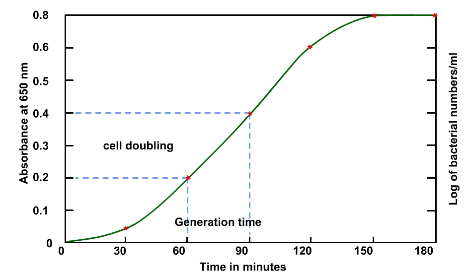
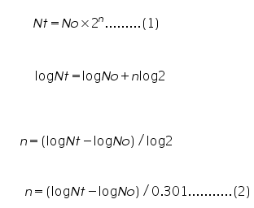
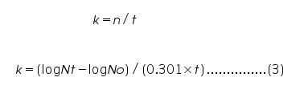
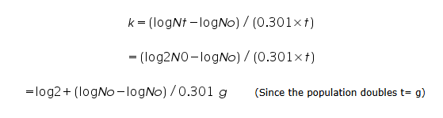
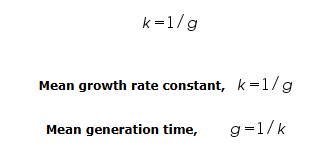

### Principle:

The increase in the cell size and cell mass during the development of an organism is termed as growth. It is the unique characteristics of all organisms. The organism must require certain basic parameters for their energy generation and cellular biosynthesis. The growth of the organism is affected by both physical and Nutritional factors. The physical factors include the pH, temperature, Osmotic pressure, Hydrostatic pressure, and Moisture content of the medium in which the organism is growing. The nutritional factors include the amount of Carbon, nitrogen, Sulphur, phosphorous, and other trace elements provided in the growth medium. Bacteria are unicellular (single cell) organisms. When the bacteria reach a certain size, they divide by binary fission, in which the one cell divides into two, two into four and continue the process in a geometric fashion. The bacterium is then known to be in an actively growing phase. To study the bacterial growth population, the viable cells of the bacterium should be inoculated on to the sterile broth and incubated under optimal growth conditions. The bacterium starts utilising the components of the media and it will increase in its size and cellular mass. The dynamics of the bacterial growth can be studied by plotting the cell growth (absorbance) versus the incubation time or log of cell number versus time. The curve thus obtained is a sigmoid curve and is known as a standard growth curve. The increase in the cell mass of the organism is measured by using the Spectrophotometer. The Spectrophotometer measures the turbidity or Optical density which is the measure of the amount of light absorbed by a bacterial suspension. The degree of turbidity in the broth culture is directly related to the number of microorganism present, either viable or dead cells, and is a convenient and rapid method of measuring cell growth rate of an organism. Thus the increasing the turbidity of the broth medium indicates increase of the microbial cell mass (Fig 1) .The amount of transmitted light through turbid broth decreases with subsequent increase in the absorbance value.

 Fig 1: Absorbance reading of bacterial suspension

 

The growth curve has four distinct phases.

#### 1. Lag phase
When a microorganism is introduced into the fresh medium, it takes some time to adjust with the new environment. This phase is termed as Lag phase, in which cellular metabolism is accelerated, cells are increasing in size, but the bacteria are not able to replicate and therefore no increase in cell mass. The length of the lag phase depends directly on the previous growth condition of the organism. When the microorganism growing in a rich medium is inoculated into nutritionally poor medium, the organism will take more time to adapt with the new environment. The organism will start synthesising the necessary proteins, co-enzymes and vitamins needed for their growth and hence there will be a subsequent increase in the lag phase. Similarly when an organism from a nutritionally poor medium is added to a nutritionally rich medium, the organism can easily adapt to the environment, it can start the cell division without any delay, and therefore will have less lag phase it may be absent.

 

#### 2. Exponential or Logarithmic (log) phase
During this phase, the microorganisms are in a rapidly growing and dividing state. Their metabolic activity increases and the organism begin the DNA replication by binary fission at a constant rate. The growth medium is exploited at the maximal rate, the culture reaches the maximum growth rate and the number of bacteria increases logarithmically (exponentially) and finally the single cell divide into two, which replicate into four, eight, sixteen, thirty two and so on (That is 20, 21, 22, 23.........2n, n is the number of generations) This will result in a balanced growth. The time taken by the bacteria to double in number during a specified time period is known as the generation time. The  generation time tends to vary with different organisms. E.coli divides in every 20 minutes, hence its generation time is 20 minutes, and for Staphylococcus aureus it is 30 minutes.

 

#### 3. Stationary phase
As the bacterial population continues to grow, all the nutrients in the growth medium are used up by the microorganism for their rapid multiplication. This result in the accumulation of waste materials, toxic metabolites and inhibitory compounds such as antibiotics in the medium. This shifts the conditions of the medium such as pH and temperature, thereby creating an unfavourable environment for the bacterial growth. The reproduction rate will slow down, the cells undergoing division is equal to the number of cell death, and finally bacterium stops its division completely. The cell number is not increased and thus the growth rate is stabilised. If a cell taken from the stationary phase is introduced into a fresh medium, the cell can easily move on the exponential phase and is able to perform its metabolic activities as usual.

 

#### 4. Decline or Death phase
The depletion of nutrients and the subsequent accumulation of metabolic waste products and other toxic materials  in the media will facilitates the bacterium to move on to the Death phase. During this, the bacterium completely loses its ability to reproduce. Individual bacteria begin to die due to the unfavourable conditions and the death is rapid and at uniform rate. The number of dead cells exceeds the number of live cells. Some organisms which can resist this condition can survive in the environment by producing endospores.

Fig 2: Different  phases of growth of a bacteria

 

### CALCULATION:

The generation time can be calculated from the growth curve(Fig 3).

Fig 3: Calculation of generation time

 

The exactly doubled points from the absorbance readings were taken and, the points were extrapolated to meet the respective time axis.

Generation Time =   (Time in minutes to obtain the absorbance 0.4) – (Time in minutes to obtain the absorbance 0.2)

= 90-60

= 30 minutes

 
 

Let No = the initial population number

Nt = population at time t

N = the number of generations in time t

Therefore,

 
 
The growth rate can be expressed in terms of mean growth rate constant (k), the number of generations per unit time.

 
 
Mean generation time or mean doubling time (g), is the time taken to double its size.

 

Therefore,

 

 
 
Substituting equation 4 in equation 3

 
 
 
Therefore,

 
